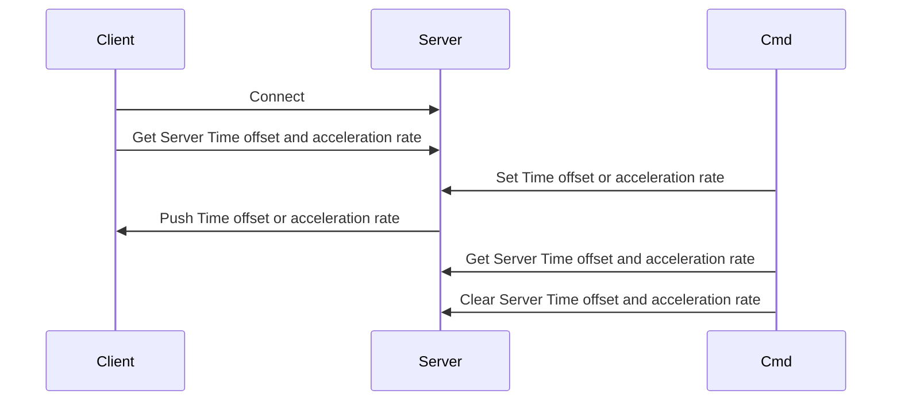

# time-manager

```mermaid
sequenceDiagram
Client->>Server: Connect
Client->>Server: Get Server Time offset and acceleration rate
Cmd->>Server: Set Time offset or acceleration rate
Server->>Client: Push Time offset or acceleration rate
Cmd->>Server: Get Server Time offset and acceleration rate
Cmd->>Server: Clear Server Time offset and acceleration rate
```
